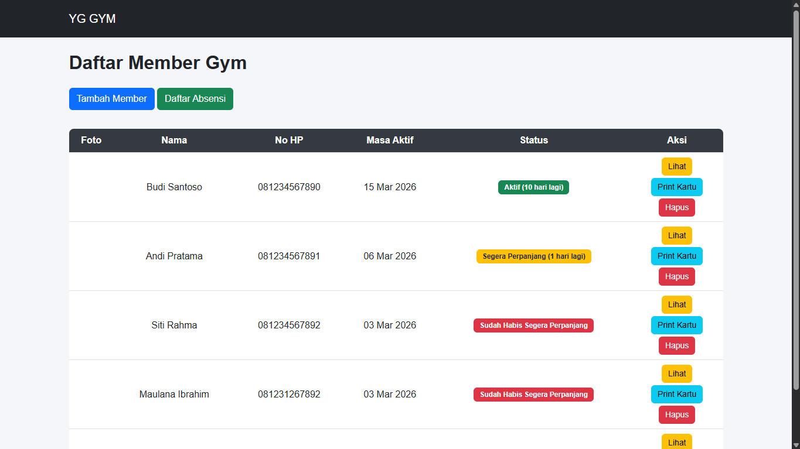
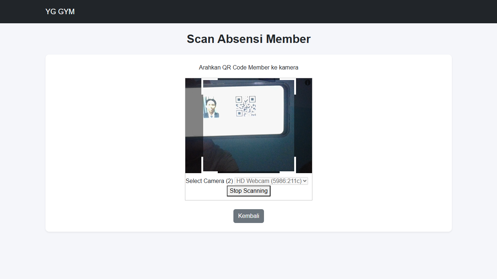
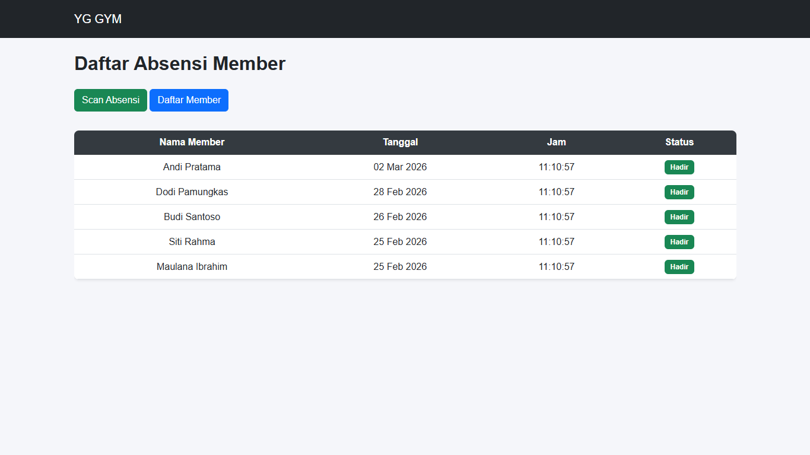

# 🏋️‍♂️ YG Gym — Member & Attendance System


Aplikasi ini dibuat untuk **mengelola member gym dan absensi menggunakan QR Code**.
Sistem memungkinkan admin gym untuk mencatat kehadiran member secara otomatis dengan melakukan **scan QR Code pada kartu member**.

---

# 🚀 Fitur Utama

✅ Manajemen Member Gym
✅ Upload foto member
✅ Generate QR Code otomatis untuk setiap member
✅ Scan QR Code untuk absensi member
✅ Validasi status membership (Aktif / Expired)
✅ Riwayat absensi member
✅ Notifikasi setelah absensi
✅ Print kartu member

---

# 🧰 Teknologi yang Digunakan

* PHP 8.2
* Laravel 12
* MySQL (XAMPP)
* Bootstrap 5
* HTML5 QR Code Scanner
* Bacon QR Code

---

# ⚙️ Cara Menjalankan Project

## 1️⃣ Clone Repository

```bash
git clone https://github.com/mfian16/yg-gym.git
cd yg-gym
```

---

## 2️⃣ Install Dependency

```bash
composer install
```

---

## 3️⃣ Copy File Environment

```bash
cp .env.example .env
```

---

## 4️⃣ Generate Application Key

```bash
php artisan key:generate
```

---

## 5️⃣ Setup Database MySQL

Buat database di **phpMyAdmin**

```
yg-gym
```

Edit file `.env`

```
DB_CONNECTION=mysql
DB_HOST=127.0.0.1
DB_PORT=3306
DB_DATABASE=yg-gym
DB_USERNAME=root
DB_PASSWORD=
```

---

## 6️⃣ Migrasi Database

```bash
php artisan migrate
```

---

## 7️⃣ Jalankan Server

```bash
php artisan serve
```

Buka browser

👉 http://127.0.0.1:8000/

---

# 🌐 Fitur Sistem

| Fitur                 | Deskripsi                       |
| --------------------- | ------------------------------- |
| Member Management     | Tambah, edit, hapus member      |
| QR Code Generator     | QR otomatis untuk setiap member |
| Attendance Scanner    | Scan QR untuk absensi           |
| Membership Validation | Cek masa aktif member           |
| Attendance History    | Riwayat absensi member          |

---

# 📂 Struktur Project

```
yg-gym/
│
├── app/
│   ├── Http/Controllers
│   │   ├── MemberController.php
│   │   └── AttendanceController.php
│   ├── Models
│   │   ├── Member.php
│   │   └── Attendance.php
│
├── database/
│   ├── migrations
│   └── seeders
│
├── resources/
│   ├── views
│   │   ├── member
│   │   ├── attendance
│   │   └── layouts
│
├── routes
│   └── web.php
│
├── public
│   └── css
├── screenshots
│   ├── member-list.png
│   ├── add-member.png
│   ├── member-detail.png
│   ├── scan-qr.png
│   ├── attendance-list.png
│   └── succes-scan.png
└── README.md
```

---

# 🧠 Cara Kerja Sistem

1️⃣ Admin menambahkan member gym
2️⃣ Sistem membuat **QR Code otomatis**
3️⃣ Member datang ke gym
4️⃣ Admin melakukan **scan QR Code**
5️⃣ Sistem mencatat absensi secara otomatis

---

# 📸 Screenshots

### Member List


### Scan QR Code


### Attendance


---

# 👤 Author

Nama: **Muhammad Fiqih Irfiansyah**

Backend Developer Enthusiast

---
