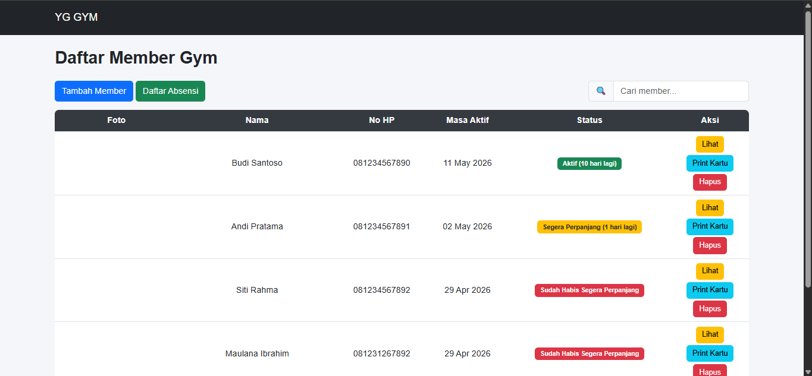
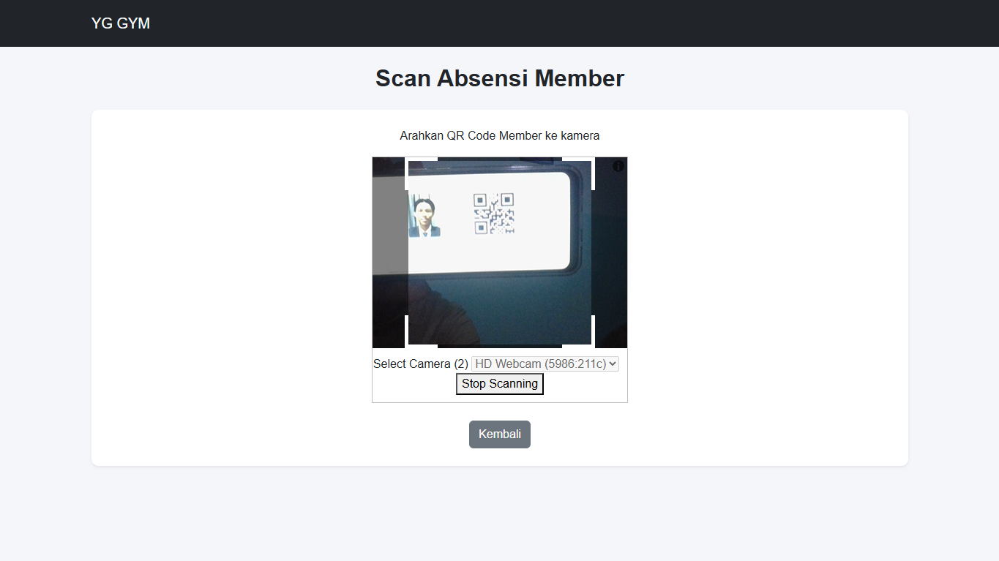
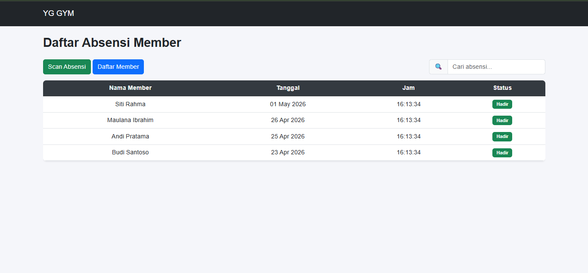

# 🏋️‍♂️ YG Gym — Member & Attendance System


Aplikasi manajemen gym berbasis Laravel yang memungkinkan pengelolaan member, absensi otomatis menggunakan QR Code, serta monitoring status membership secara real-time.

# 🎯 Latar Belakang

Banyak bisnis gym masih mengelola absensi member secara manual, sehingga proses pencatatan menjadi kurang efisien dan monitoring status membership menjadi lebih sulit.

Project ini dibuat sebagai solusi digital untuk membantu pengelolaan member gym melalui sistem absensi otomatis berbasis QR Code, validasi masa aktif membership, serta pencatatan riwayat absensi secara terintegrasi.

---

# 🚀 Fitur Utama

✅ CRUD member management
✅ Search member & attendance data
✅ Upload foto member
✅ Generate QR Code otomatis untuk setiap member
✅ Scan QR Code untuk absensi member
✅ Validasi status membership (Aktif / Expired)
✅ Riwayat absensi member
✅ Notifikasi setelah absensi
✅ Print kartu member

---

# ✨ Highlights

- Sistem absensi otomatis berbasis QR Code
- QR Code-based attendance automation
- Membership status validation (Active / Expired)
- Member card PDF generation
- Real-time search for member and attendance data
- Struktur project clean & scalable

---

# 🧰 Teknologi yang Digunakan

* PHP 8.2
* Laravel 12
* MySQL (XAMPP)
* Bootstrap 5
* jQuery
* Vite
* HTML5 QR Code Scanner
* Bacon QR Code

---

# ⚙️ Cara Menjalankan Project

## 1️⃣ Clone Repository

```bash
git clone https://github.com/mfian16/yg-gym.git
cd yg-gym
```

---

## 2️⃣ Install Dependency

```bash
composer install
npm install
```

---

## 3️⃣ Copy File Environment

```bash
cp .env.example .env
```

---

## 4️⃣ Generate Application Key

```bash
php artisan key:generate
```

---

## 5️⃣ Setup Database MySQL

Buat database di **phpMyAdmin**

```
yg-gym
```

Edit file `.env`

```
DB_CONNECTION=mysql
DB_HOST=127.0.0.1
DB_PORT=3306
DB_DATABASE=yg-gym
DB_USERNAME=root
DB_PASSWORD=
```

---

## 6️⃣ Migrasi Database

```bash
php artisan migrate
```

---

## 7️⃣ Jalankan Server

```bash
npm run dev
php artisan serve
```

Buka browser

👉 http://127.0.0.1:8000/

---

# 🌐 Fitur Sistem

| Fitur                 | Deskripsi                       |
| --------------------- | ------------------------------- |
| Member Management     | Tambah, edit, hapus member      |
| QR Code Generator     | QR otomatis untuk setiap member |
| Attendance Scanner    | Scan QR untuk absensi           |
| Membership Validation | Cek masa aktif member           |
| Attendance History    | Riwayat absensi member          |
| Search Feature        | Pencarian member & absensi secara real-time|

---

# 📂 Struktur Project

```
yg-gym/
│
├── app/
│   ├── Http/Controllers
│   │   ├── MemberController.php
│   │   └── AttendanceController.php
│   ├── Models
│   │   ├── Member.php
│   │   └── Attendance.php
│
├── database/
│   ├── migrations
│   └── seeders
│
├── resources/
│   ├── views
│   │   ├── member
│   │   ├── attendance
│   │   └── layouts
│
├── routes
│   └── web.php
│
├── public
│   └── css
├── screenshots
│   ├── member-list.png
│   ├── add-member.png
│   ├── member-detail.png
│   ├── scan-qr.png
│   ├── attendance-list.png
│   └── success-scan.png
└── README.md
```

---

# 🧠 Cara Kerja Sistem

1️⃣ Admin menambahkan member gym
2️⃣ Sistem membuat **QR Code otomatis**
3️⃣ Member datang ke gym
4️⃣ Admin melakukan **scan QR Code**
5️⃣ Sistem mencatat absensi secara otomatis

---

# 📸 Screenshots

### Member List


### Scan QR Code


### Attendance


---

# 👤 Author

Nama: **Muhammad Fiqih Irfiansyah**

Junior Web Developer Enthusiast

---
